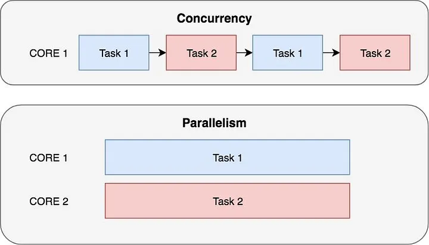
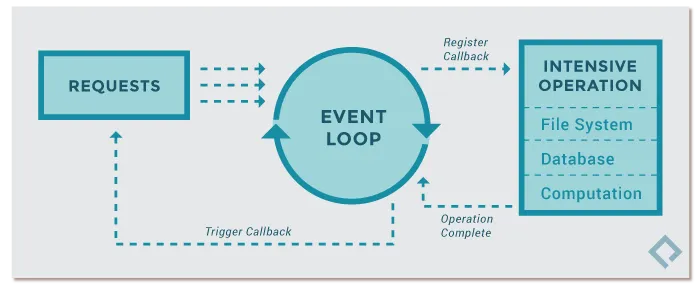

*******************************************************************************
                    CONCURRENCY AND PARALLELISM
*******************************************************************************


*******************************************************************************
                                DEFINITIONS
*******************************************************************************

|  Program   |  Process[es]   |  Thread[s]                    |
|:----------:|:--------------:|:-----------------------------:|
|      1     |     1...n      |   1...n*m                     |
| e.g. Word  | e.g. n-windows | e.g. each window do m-things  |

---

- **Program**:

    Passive collection of instructions e.g. stored in a file on disk\
    The same program can have several processes running.

- **Process**:

    Instance of a program, executed by one or ma-ny threads.\
    Process (or task) is "something that takes up time", as opposed to\
    "memory", which is "something that takes up space"

- **Thread (of execution)**:

    A sequence of instructions executed within the context of a process. 

---

Multitasking, multiprogramming, multiprocessing, multithreading...

    Methods to share resources.
    
    Note: each CPU (core) executes a single thread at a time.

---

## **CONCURRENCY**

Concurrency is about **managing** multiple tasks at the same time, allowing them to make progress independently—even if not simultaneously.

It means that at least two threads or processes are **making progress** during overlapping periods.

    Concurrency is a broader concept than parallelism: it includes techniques like time-slicing, where a single CPU rapidly switches between tasks to create the illusion of simultaneous execution (virtual parallelism).

## **PARALLELISM**


Parallelism is about **performing** multiple tasks at the exact same time.

It occurs when at least two threads or processes are **executing simultaneously**—for example, on separate CPU cores or processors.

    True parallelism requires hardware support, such as multicore CPUs or distributed systems, enabling tasks to literally run side by side.

## **Asynchrony**

Asynchrony enables a program to **initiate tasks and continue running without waiting for them to finish**.

It creates the impression of concurrency or parallelism, especially in I/O-bound operations, by not blocking the application while waiting for responses (e.g., fetching data from a server).

    In asynchronous programming:
    1. The program issues a request (such as a network call or file read)
    2. Immediately regains control, often providing a callback, promise, or using constructs like async/await to handle the result when it arrives.

    This approach keeps applications responsive—such as not freezing a UI while waiting for data.

    Common examples include AJAX, WebSockets, Promises, Observables, and async/await in modern programming languages.


---
---

## Concurrency

    Concurrency occurs when two or more tasks can begin, execute, and finish during overlapping time periods—though not necessarily at the exact same instant.

    For example, on a single-core CPU, multitasking is achieved through time slicing: the CPU rapidly switches between tasks, giving the illusion that they are running simultaneously (virtual multitasking).

        +--------+-----------+--------+-----------+--------+
        |  core  |  Task 1   | Task 2 |  Task 1   | Task 2 |
        +--------+-----------+--------+-----------+--------+

    In this scenario, both tasks make progress over time, even though only one is actively running at any given moment.

## Parallelism

    Parallelism occurs when two or more tasks are executed at the exact same time—true multitasking.

    This is possible when there are multiple processing units available, such as multicore CPUs, clusters of computers, or distributed systems (e.g., several EC2 instances in the cloud).

        +--------+--------+--------------+
        | core 1 |      Task 1           |
        +--------+--------+--------------+
        | core 2 |      Task 2           |
        +--------+--------+--------------+

    In this scenario, each core or processor runs its own task simultaneously, so both tasks make progress at the same instant.

---
---

### Example: visual representation of concurrency and parallelism


### Further reading:
In-depth article on mastering asyncio and concurrency in Python
[See this nice article in Medium](https://blog.stackademic.com/mastering-asyncio-and-concurrency-in-python-76b94d050a77)


### Diagram:
Comparison of concurrency and parallelism concepts



### Diagram:
How asynchronous programming works



---
---

### **Process:**

    An environment created which is set up to run a program.

### **Thread**
    
    A basic unit of CPU utilization, comprising a thread ID, a program counter, a register set, and a stack.
    
    A set of instructions executed within the context of a process.

---

* Intensive CPU tasks (CPU bound)
* Intensive IO tasks (IO bound)

---
*******************************************************************************
                        CPython implementation detail
*******************************************************************************

    In CPython, due to the GIL, only one thread can execute Python code at once
    (even though certain performance-oriented libraries might overcome this
    limitation).
    
    If you want your application to make better use of the
    computational resources of multi-core machines, you are advised to use
    multiprocessing or concurrent.futures.ProcessPoolExecutor.
    
    However, threading is still an appropriate model if you want to run
        multiple I/O-bound tasks simultaneously.

    Use ThreadPoolExecutor  for intensive IO tasks. (aka. concurrency)
    Use ProcessPoolExecutor for Intensive CPU tasks. (aka. parallelism)

---
---
---


https://forms.office.com/Pages/ResponsePage.aspx?id=eME_CzC3i06YQ-gSWSN7d7VB9bTbMJ9Mh3W7X1zAylhUNzFEWkxZV1pFVEQ5UkVTQkFNQUdDUk9EVCQlQCN0PWcu


*******************************************************************************
                            Threads - Basic
*******************************************************************************
https://www.pythontutorial.net/python-concurrency/python-threading/

```python
new_thread = Thread(target=func_name,args=params_tuple)
new_thread.start()
new_thread.join()   # Wait until finish
```


*******************************************************************************
                            Thread Pool Executor
*******************************************************************************

https://www.pythontutorial.net/python-concurrency/python-threadpoolexecutor/

https://docs.python.org/3.8/library/concurrent.futures.html#concurrent.futures.ThreadPoolExecutor

```python
from concurrent.futures import ThreadPoolExecutor, as_completed
import urllib.request

URLS = ['http://www.foxnews.com/',
        'http://www.cnn.com/',
        'http://europe.wsj.com/',
        'http://www.bbc.co.uk/',
        'http://some-made-up-domain.com/']

def load_url(url, timeout):
    with urllib.request.urlopen(url, timeout=timeout) as conn:
        return conn.read()

# We can use a with statement to ensure threads are cleaned up promptly
with ThreadPoolExecutor(max_workers=5) as executor:
    result = {}
    # Start the load operations and mark each future with its URL
    future_to_url = {executor.submit(load_url, url, 60): url for url in URLS}
    for future in as_completed(future_to_url):
        url = future_to_url[future]
        try:
            result[url] = future.result()
        except Exception as exc:
            print(f"{url} generated an exception: {exc}")
        else:
            print(f"{url} page is {len(result[url])} bytes")
```


*******************************************************************************
                            Process Pool Executor
*******************************************************************************

```python
from concurrent.futures import ProcessPoolExecutor,
import urllib.request

URLS = ['http://www.foxnews.com/',
        'http://www.cnn.com/',
        'http://europe.wsj.com/',
        'http://www.bbc.co.uk/',
        'http://some-made-up-domain.com/']

def load_url(url, timeout):
    with urllib.request.urlopen(url, timeout=timeout) as conn:
        return conn.read()

with ProcessPoolExecutor() as executor:
    result = {}
    for url, load in zip(URLS, executor.map(load_url, URLS)):
        result[url] = load
        print(f"{url} page is {len(load)} bytes")
```


*******************************************************************************
                                Some Resources
*******************************************************************************
https://docs.python.org/3/library/asyncio.html\
https://www.youtube.com/watch?v=t5Bo1Je9EmE\
https://www.youtube.com/watch?v=9zinZmE3Ogk\
https://www.youtube.com/watch?v=5nXmq1PsoJ0

https://docs.python.org/3/library/concurrent.futures.html\
https://gist.github.com/miguelgrinberg/f15bc03471f610cfebeba62438435508\
https://greenlet.readthedocs.io/en/latest/\
https://pypi.org/project/greenlet/\
https://github.com/gevent/gevent

https://github.com/volker48/python-concurrency

https://docs.oracle.com/cd/E19455-01/806-5257/6je9h032b/index.html\
https://stackoverflow.com/questions/1050222/what-is-the-difference-between-concurrency-and-parallelism
https://stackoverflow.com/questions/4844637/what-is-the-difference-between-concurrency-parallelism-and-asynchronous-
    methods

General concurrent models
    Petri nets, process calculi, the parallel random-access machine model,
    the actor model and the Reo Coordination Language.


